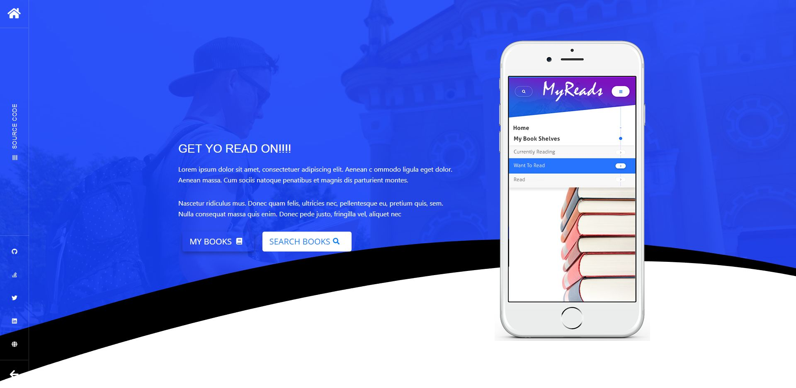

# React MyReads

This is a customized book favoriting application built on ReactJS . 

# Todo
- [x] Complete basic [rubric requirements](https://review.udacity.com/#!/rubrics/918/view)
- [x] Add book shelf counter
- [x] Add FontAwesome support
- [x] Add drag & drop functionality
- [ ] Add dynamic rating for each book
- [ ] Add flip card UI for books
- [ ] Convert search UI to overlay
- [ ] Add Tab style UI for shelves/categories
- [ ] Update read-me  

### Codebase
- ReactJS 16
- Bootstrap 4
- Fontawesome 5.0
- React DND

### Usage
* install all project dependencies with `npm install`
* start the development server with `npm start`